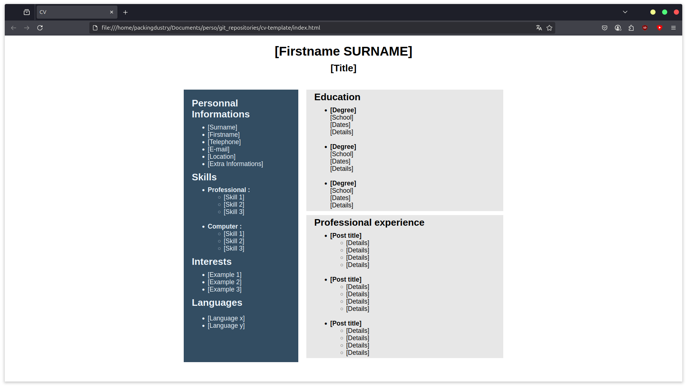

*You are on the French version, go to `main` branch for English version.*
# CV Template
Ceci est le modèle de mon CV.

Ce repository est disponnible sous licence CC0.<br>

Vous êtes libre de l'utiliser, le modifier et le partager comme vous voulez.

## Exemple de capture d'écran


## Installation et utilisation
Clonez le repository
```bash
git clone https://github.com/Packingdustry/cv-template.git
```
Basculez sur la branche `main-fr`
```bash
git checkout main-fr
```
Le modèle est du simple HTML/CSS vanilla, vous avez seulement besoin d'un éditeur de texte pour le modifier et d'un navigateur pour le visualiser.
